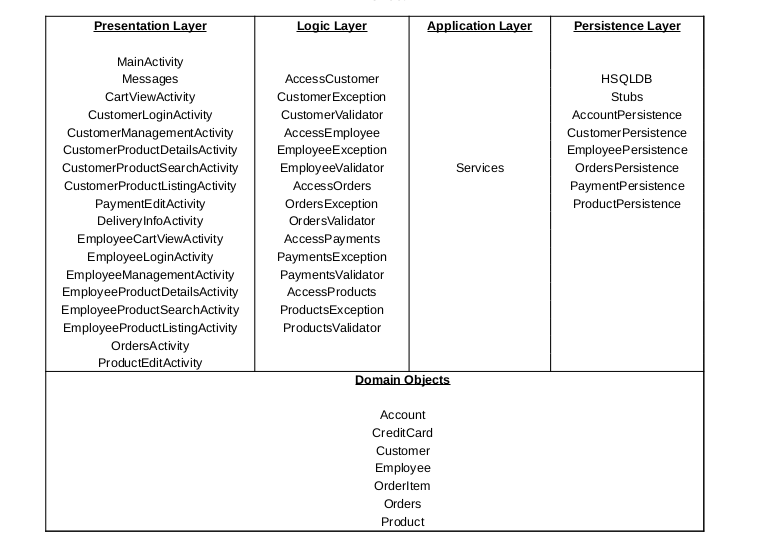
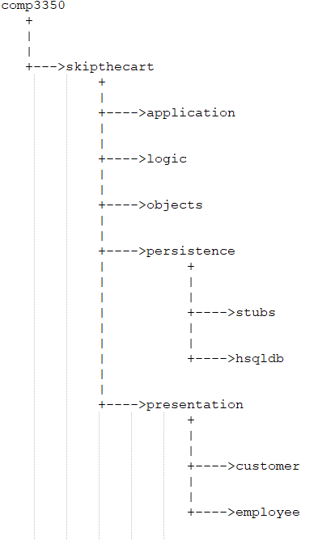

# Application Architecture

# Package Structure

# Package Description

## presentation
Contains activity classes that are responsible for displaying visual information
and acquiring input from the user. Classes within the *product* package allows
users to view and edit product information, such as name, price and description.
Classes within the *account* package provides users with a home and login screen
from which they can input user name and password information.

## logic
*AccessAccount* and *AccessProducts* classes handle operations for verifying,
retrieving and modifying user account and product information obtained from the
*persistence* layer via the *application* layer. Results of each operation are
then sent back to the presentation layer for the user to view. *AccessPayment*
handles verification of customer payment information. *AccessOrders* allows
access to customer order information for purchases.

## application
*Services* class provides the logic layer with access to the current instance of
product and account stub databases in the persistence layer.

## persistence
*stubs* package contains classes that implement interfaces for accessing the
stub databases of domain model objects which represent accounts and products.
*hsqldb* is similar, but implements a SQL database for data persistence.

## objects
Consists of classes representing real world objects that are passed between each
layer in order to relay the requested data, such as *Employee* or *Product*
information.

# Application's Current State
Customer is able to login with the user name *noodles* and password *password*.
Employee is able to login with the user name *test* and password *password*. For the delivery driver the user name is *lpeon* and password *password*.
Afterwards, products are shown, which can each be selected in order to view
further product details, as well as providing the ability to edit the product’s
information if user is employee and or add to cart if customer. New products can
also be added using the **+** floating action button. Customer is also able to
update their credit card information. Both user types can also edit their
personal account information by pressing the action button on the top right hand
corner of the screen when viewing the product list. The customer can click on the cart button to view the products he/she added to the cart, and can checkout the order. For the employee he/she can view the live orders and order history. The employee can click on the order to view the items in the order along with the quantity and can place the order for shipping by clicking on send for delivey. The driver can see the delivery info if he/she clicks on the orders and can change the status of the order to finish by flicking on Delivered button.
Both the customers and the employees can search for a product by clicking on the search icon and entering the product name they are looking for.
