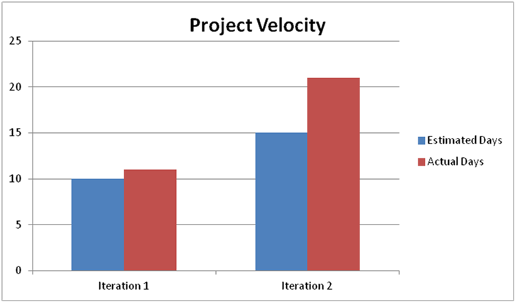

Looking back on our project, it is very clear that we accumulated too much 
technical debt in all of the iterations. We should have done much more concrete
planning before each of our iterations too avoid stupid design choices, and the
many code smells that came as a result. Especially in iteration 2, we were too 
focused on adding some new features and scrambling to polish up the code, after
a git related error caused a large amount of Chris's work to be lost, which in
turn caused us to lose quite a lot of marks. As for actually improving this, if
we could go back in time to the start of the project and start over again, we 
would spend much more time having actual planning meetings instead of just going
crazy with coding. We should have made some diagrams of what we wanted the 
structure of our project to look like before we tried to add code. Sure we had
features, user stories, and tasks, but those alone were not enough to make a 
true success out of each iteration. As far as success goes for the project, we 
could have been much more successful. Sure, we have been over-stuffing our
project with features, but we were just making the minimum amount of features
for each iteration and we could have had more. Measurably however, I think
we were successful, as we did meet the requirements for each iteration. 
Our product has met the outlined requirements as was presented with the 
course, but objectively the app is not complete, and so it was not a 
success to finish the whole thing in the development timeline.

